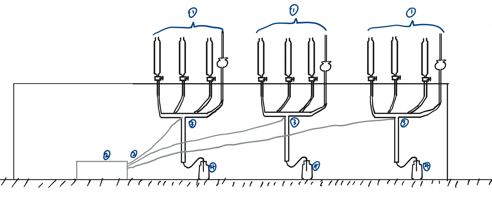
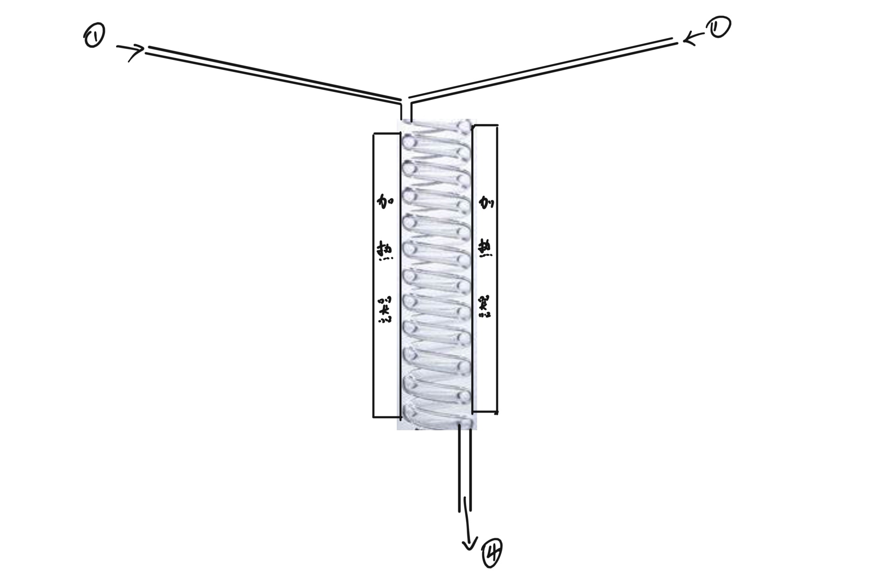
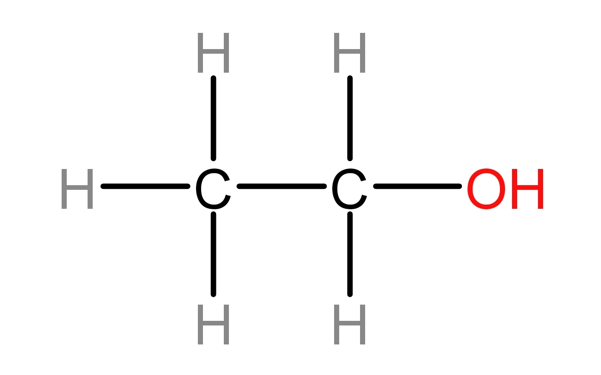
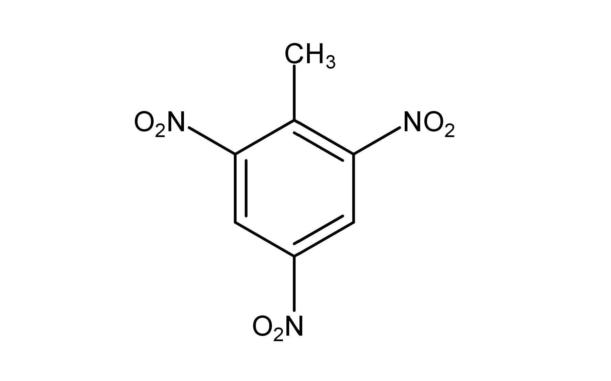

# 项目综述

注：所有图将在实际实验后以实物图替代

刘东奇 姚雨森

## 项目简介

目前，随着我国科技的发展，化学工业在生产、生活中的应用越来越广泛，同时暴露出了我国化学工业领域目前的主要问题：路线设计不够合理，产率不高，技术与目前先进技术（如人工智能）结合程度不高。

基于此，为了探索现代计算机技术和微反应技术在化学工业和有机化学研究方面的作用，我们设计了“高自动化集成微反应工作站”。它可以根据使用者输入的有机物结构简式，自动寻找合成路线，并通过微反应技术合成出对应有机物。

在化工领域，相比于传统间歇式反应器，微反应器拥有产率高、纯度高、安全性高、节省空间的特点，这可以极大地节省原材料，提高产物纯度，在同等空间下提升化工厂的产量。并且由于微反应器反应精确的特点，可以最大程度上做到环保。

在有机化学和生物化学的研究领域，自动化集成反应可以为实验室定制所需的有机物，从而提高研究效率并节省开销。

## 高自动化集成微反应工作站设计介绍

图1 初步设计主视图

1. 加料模块。该模块由四个漏斗、对应电机、支架和乳胶导管组成。左起的前三个漏斗为分液漏斗，作用为储存、添加反应物。第四个为长颈漏斗，用于加水。四个漏斗的活塞均有对应电机控制。

2. 控压模块。该模块由三个小型气泵（图中为简洁只画出一个）及导气管组成，当加料模块加料完毕后活塞将关闭，待T型反应器内反应结束后，气泵将向装置中泵入空气（若在以后遇到需要隔绝氧气的实验，则设计泵入氮气的装置，这个以后再说），制造压强差，将装置中的生成物完全泵入收集模块中。

3. T型反应器。内部为蛇形冷凝器式设计（图在下方），管外有加热器和温度传感器，反应在此处进行。反应结束后产物将从底部的乳胶导管进入收集装置中。

4. 收集装置。收集装置由一根乳胶导管和一个试剂瓶组成。用于收集反应产物。根据不同需要可选在在其中加入水，乙醇或二甲基亚砜等溶剂。

图2 微反应器装置主视图

图3 微反应器装置俯视图

## 具体操作介绍

使用者需在电脑中使用ssip系统（下面有介绍）输入所需的有机物，系统会自动寻找最合适的合成路径并提示使用者应在加料模块中添加的药品，待添加完毕后，自动开始合成。

## 机电部分介绍

该项目使用了一台搭载Linux系统的树莓派开发板作为控制核心，通过预搭建的虚拟局域网和操作主机进行交互，操作主机方面通过自研的ssip系统将结构简式转为字符串。同时可以通过传感器实时监控的设备的运行情况，以便进行调整。

对于设备本身，通过核心自研算法对传感器的原始数据进行整合和计算，快算判断输入的反应是否正确同时通过。小型数据库反映反应时间及计算产量，同时调用反应所需的设备。

设备通过其上安装的数个微型蠕动液泵将贮存在漏洞内的药品精准输入反应管，充分保证了微反应进行的精确性，装置的特殊材质及恒温加热装置也为反应精确稳定进行保驾护航。

同时其上装有的7英寸屏幕和蓝牙设备保证了即使脱离操作主机也可以进行预存储的反应。所以操作均是以高精确度和高自动化为标准，和微反应自身的优点一起充分体现了该项目的优势和价值。

## ssip语言介绍

ssip是skeleton symbol input的简写，是我们自主研发的结构简式的输入、管理系统。它将结构简式转化为ssip形式。

ssip形式是结构简式的字符串形式表达，它用于以字符串的形式记录结构简式，并用于合成路径计算机推导等方面。

（由于技术原因，省赛的版本需要使用者自行转化并输入ssip形式）

ssip形式规则如下：

我们参考了中文有机化合物的命名法。

对于开链化合物（即脂肪族化合物），首先判断主链，将主链每个碳原子分别写出，在其后跟上连接的基团，侧链则在碳后加一个()，将侧链基团写在括号内。

如乙醇，结构简式如下：

图4 乙醇结构简式

则写为ssip形式为：CH2(H)C2(H)OH

环状化合物则在最外层加[]，对于环中一样的碳原子，在外加数字<>，对于官能团，在前加上碳位。

如均三硝基甲苯，结构简式为：

图5 均三硝基甲苯结构简式

则需表示为：[<CH3>2<CH2>41(CH3)246(NO2)]

一些常用基团如苯，则有定义“BEN”，可直接用BEN代替苯的ssip形式。

故均三硝基甲苯亦可表示为：1(CH3)246(NO2)BEN

## 高自动化集成微反应工作站优势

微反应与自动控制系统的结合使得高自动化集成微反应工作站具有传统化工技术并不具有的产率高、纯度高的优势。

****实验

人工实验数据

工业实践数据

高自动化集成微反应工作站数据

以此约4个实验即可

## 微反应研究现状

## 致谢

## 引用